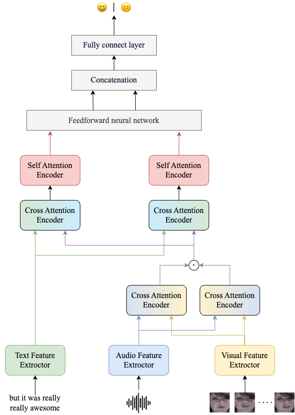

# Multimodal Sentiment Analysis Task

This project aims to perform sentiment analysis using multimodal data (text, audio, and video). The project includes four main modules: text feature extraction, audio feature extraction, video feature extraction, and cross-attention feature fusion. The model is tested on the CMU-MOSI dataset.

The model architecture is designed end-to-end, where the feature extraction parts are also involved in the training process.



## Feature Extractors

Text: Features are extracted using the twitter-roberta-base-sentiment-latest model.

Audio: Features are extracted using the openai/whisper-base model.

Video: Features are extracted using the google/vit-base-patch16-224 model combined with an LSTM.

All pretrained models can be downloaded from Hugging Face https://huggingface.co/. 

## Feature Fusion Network

The feature fusion network includes cross-attention to fuse multimodal features, followed by self-attention for further feature extraction. A shared feedforward neural network aligns the extracted features and enhances non-linear information.

## Dataset
The dataset used is CMU-MOSI, which can be downloaded from the official website:
http://multicomp.cs.cmu.edu/resources/cmu-mosi-dataset/

## File Structure
```
project_root/
│
├── data/
│   ├── raw/                   # Raw data
│   ├── processed/             # Processed data
│
├── models/
│   ├── audio_classification/              # Single audio classification model
│   ├── text_classification/               # Single text classification model
│   ├── visual_classification/             # Single video classification model
│   ├── audio_text_classification/         # Text and audio bimodal classification model
│   ├── audio_text_visual_classification/  # Text, audio, and video trimodal classification model
│
├── scripts/
│   ├── text_preprocess_data.py            # Text data preprocessing
│   ├── audio_preprocess_data.py           # Audio data preprocessing
│   ├── visual_preprocess_data.py          # Video data preprocessing
│
├── README.md                              # Project introduction
```
## Running the Project

After downloading the dataset, place it in the data directory and execute the three preprocessing scripts. Ensure you modify the data output paths in the preprocessing scripts. Save the processed data in the data/processed directory.

Once the data is processed, you can train and test the models by directly executing the models in the models directory. Remember to modify the dataset paths and pretrained model paths in the models accordingly.

